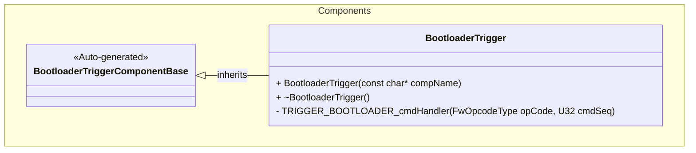
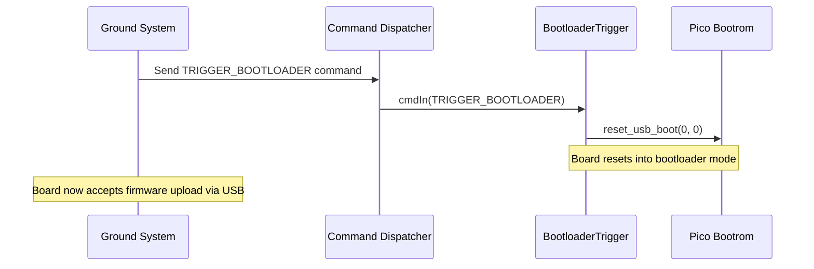

# Components::BootloaderTrigger

The BootloaderTrigger component provides a command interface to reset the board into bootloader mode for firmware installation during integration testing. **WARNING: This component should NOT be used in production or flight configurations.**

## Usage Examples

The BootloaderTrigger component is designed to facilitate firmware updates during ground testing and integration. It operates as a passive component that responds to commands.

### Typical Usage

1. The component is instantiated during system startup
2. During integration testing, when firmware needs to be updated:
   - The `TRIGGER_BOOTLOADER` command is sent to the component
   - The board immediately resets into bootloader mode
   - Firmware can then be uploaded via USB

**IMPORTANT:** This component should be removed or disabled for flight builds to prevent accidental activation in space.

## Class Diagram

## Port Descriptions

| Name           | Type         | Description                            |
| -------------- | ------------ | -------------------------------------- |
| cmdIn          | command recv | Port for receiving commands            |
| cmdResponseOut | command resp | Port for sending command responses     |
| cmdRegOut      | command reg  | Port for sending command registrations |
| timeCaller     | time get     | Port for requesting the current time   |

## Sequence Diagrams

## Commands

| Name               | Description                                                                                                                                                          |
| ------------------ | -------------------------------------------------------------------------------------------------------------------------------------------------------------------- |
| TRIGGER_BOOTLOADER | Restarts the board and puts it into bootloader mode. This is a synchronous command that triggers an immediate reset. Should only be used during integration testing. |

## Requirements

| Name                        | Description                                                                                                                  | Validation                                                                                                    |
| --------------------------- | ---------------------------------------------------------------------------------------------------------------------------- | ------------------------------------------------------------------------------------------------------------- |
| TRIGGER_BOOTLOADER Command  | The component shall provide a command interface to reset the board into bootloader mode using the Pico bootrom API           | Verify that sending the command causes the board to reset and enter bootloader mode, allowing firmware upload |
| Safety Warning              | The component shall include clear documentation warnings that it must not be used in flight configurations                   | Documentation review and code review process                                                                  |
| Integration Testing Support | The component shall enable firmware updates during ground integration testing without requiring physical access to boot pins | Verify successful firmware updates can be performed remotely during testing                                   |

## Change Log

| Date       | Description   |
| ---------- | ------------- |
| 2025-10-01 | Initial Draft |
