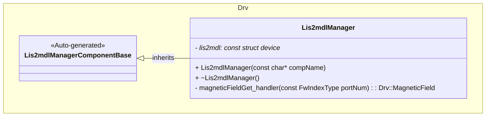
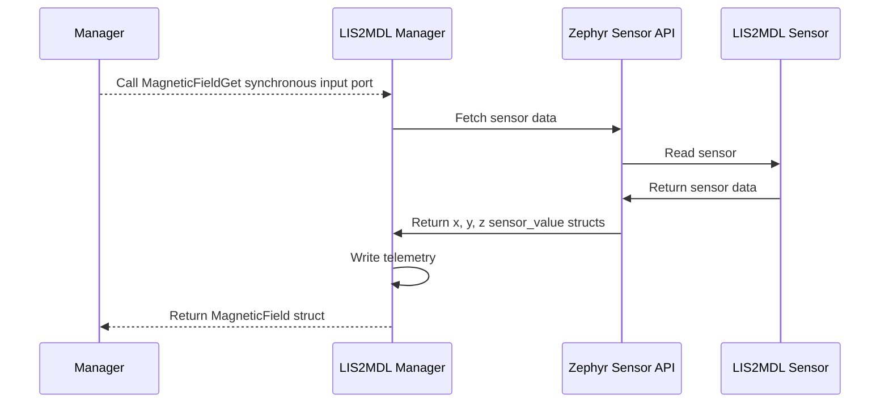

# Drv::Lis2mdlManager

The LIS2MDL Manager component interfaces with the LIS2MDL magnetometer to provide magnetic field measurements.

## Usage Examples

The LIS2MDL Manager component is designed to be called periodically to collect and return sensor data. It operates as a passive component that responds to manager calls.

### Typical Usage

1. The component is instantiated and initialized during system startup
2. A manager calls the `MagneticFieldGet` port
3. On each call, the component:
   - Fetches fresh sensor samples from the sensor
   - Converts sensor data to F Prime data structures
   - Writes telemetry data
   - Returns data in SI units

## Class Diagram

## Port Descriptions
| Name | Type | Description |
|---|---|---|
| MagneticFieldGet | sync input | Triggers magnetic field data collection and returns a MagneticField struct |

## Sequence Diagrams

## Requirements
Add requirements in the chart below
| Name | Description | Validation |
|---|---|---|
| MagneticFieldGet Port | The component shall provide access magnetic field sensor data and return in MagneticField struct, readings will be in gauss | Verify output matches expected values from sensor datasheet |

## Change Log
| Date | Description |
|---|---|
| 2025-9-15 | Initial LIS2MDL Manager component |
