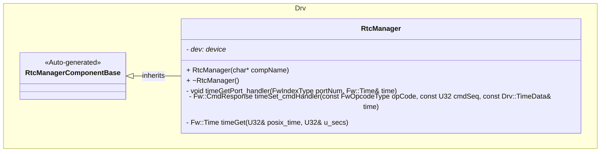
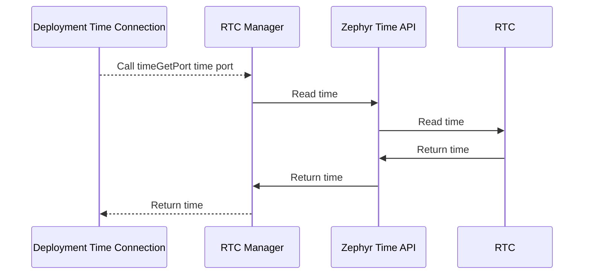
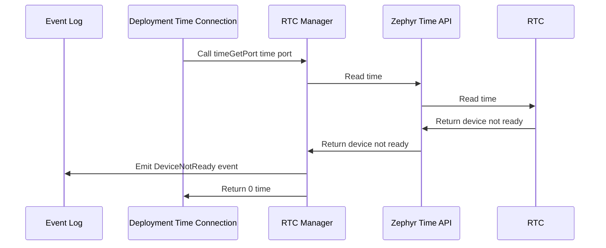
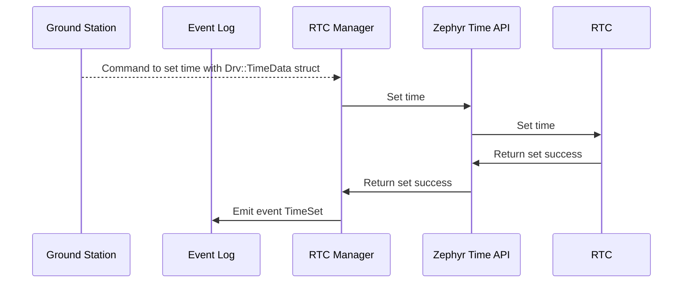
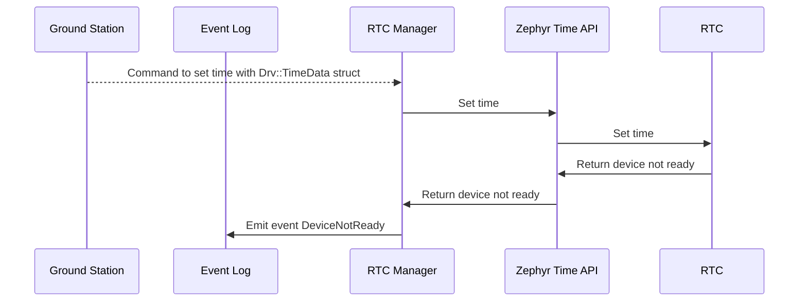
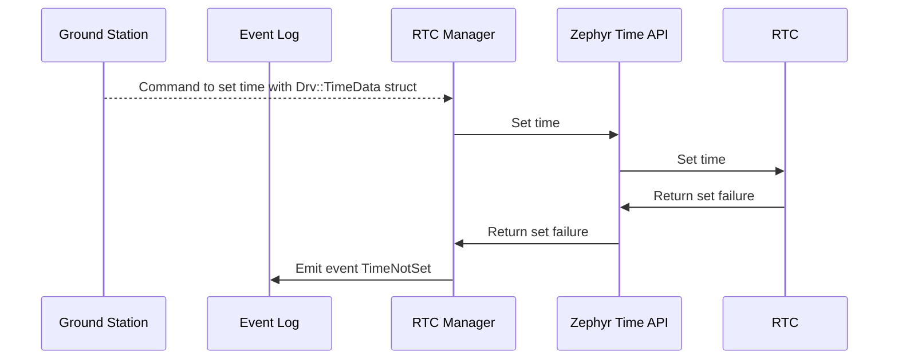

# Components::RtcManager

The RTC Manager component interfaces with the RTC Real Time Clock (RTC) to provide time measurements.

### Typical Usage

#### `TIME_SET` Command Usage
1. The component is instantiated and initialized during system startup
2. A ground station sends a `TIME_SET` command with the desired time
3. On each command, the component:
    - Sets the time on the RTC
    - Emits a `TimeSet` event if the time is set successfully
    - Emits a `TimeNotSet` event if the time is not set successfully
    - Emits a `DeviceNotReady` event if the device is not ready

#### `timeGetPort` Port Usage
1. The component is instantiated and initialized during system startup
2. In a deployment topology, a `time connection` relation is made.
3. On each call, the component:
    - Fetches and returns the time from the RTC
    - Emits a `DeviceNotReady` event if the device is not ready

#### `timeGet` Port Usage
1. The component is instantiated and initialized during system startup
2. A manager calls the `timeGet` ports
3. On each call, the component:
    - Fetches and returns the time from the RTC
    - Emits a `DeviceNotReady` event if the device is not ready

## Requirements
| Name | Description | Validation |
|---|---|---|
| RtcManager-001 | The RTC Manager has a command that sets the time on the RTC | Integration test |
| RtcManager-002 | The RTC Manager has a port which, when called, set the time in FPrime | Integration test |
| RtcManager-003 | A device not ready event is emitted if the RTC is not ready | Manual |
| RtcManager-004 | A time set event is emitted if the time is set successfully | Integration test |
| RtcManager-005 | A time not set event is emitted if the time is not set successfully | Integration test |

## Port Descriptions
| Name | Description |
|---|---|
| timeGetPort | Time port for FPrime topology connection to get the time from the RTC |

## Commands
| Name | Description |
|---|---|
| SET_TIME | Sets the time on the RTC |

## Events
| Name | Description |
|---|---|
| DeviceNotReady | Emits on unsuccessful device connection |
| TimeSet | Emits on successful time set |
| TimeNotSet | Emits on unsuccessful time set |

## Class Diagram

## Sequence Diagrams

### `timeGetPort` port

The `timeGetPort` port is called from a `time connection` in a deployment topology to sync the RTC's time with FPrime's internal clock.

#### Success

#### Device Not Ready

### `TIME_SET` Command

The `TIME_SET` command is called to set the current time on the RTC.

#### Success

#### Device Not Ready

#### Time Not Set

## Change Log
| Date | Description |
|---|---|
| 2025-9-18 | Initial RTC Manager component |
