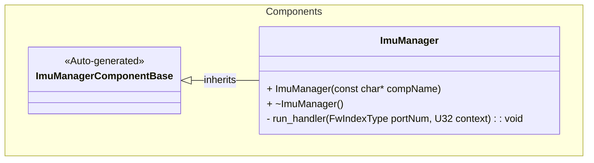
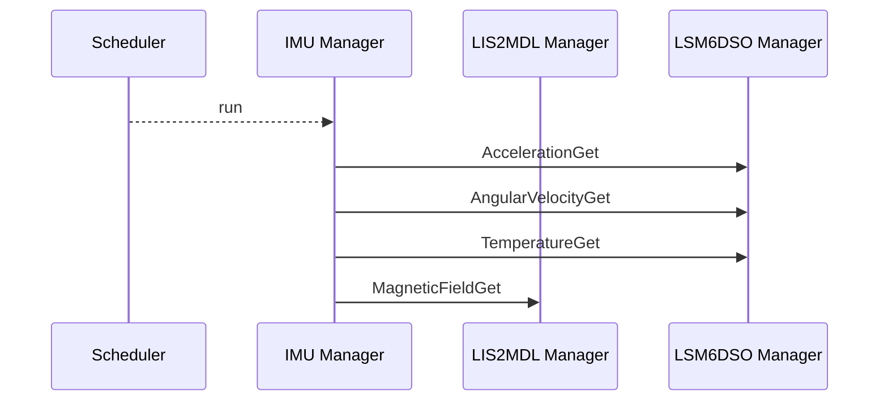

# Components::ImuManager

The IMU Manager (Inertial Measurement Unit) component provides sensor data related to motion and orientation of the craft. It interfaces with two drivers: the LIS2MDL Manager and the LSM6DSO Driver which provide acceleration, angular velocity, magnetic field, and temperature measurements.

## Usage Examples

The IMU Manager component is designed to be scheduled periodically to trigger collection of sensor data and telemetering. It operates as a passive component that responds to scheduler calls.

### Typical Usage

1. The component is instantiated and initialized during system startup
2. The scheduler calls the `run` port at regular intervals
3. On each run call, the component:
   - Fetches sensor data from both the LIS2MDL Manager and LSM6DSO Driver
   - Outputs telemetry for acceleration, angular velocity, magnetic field, and temperature

## Class Diagram

## Port Descriptions
| Name | Type | Description |
|---|---|---|
| run | sync input | Scheduler port that triggers sensor data collection |
| accelerationGet | output | Port for calling accelerationGet on the LSM6DSO Manager |
| angularVelocityGet | output | Port for calling angularVelocityGet on the LSM6DSO Manager |
| magneticFieldGet | output | Port for calling magneticFieldGet on the LIS2MDL Manager |
| temperatureGet | output | Port for calling temperatureGet on the LSM6DSO Manager |
| timeCaller | time get | Port for requesting current system time |

## Sequence Diagrams

## Requirements
| Name | Description | Validation |
|---|---|---|
| Sensor Data Collection | The component shall trigger data collection from both LSM6DSO and LIS2MDL sensors when run is called | Verify all sensor manager output ports are called |
| Periodic Operation | The component shall operate as a scheduled component responding to scheduler calls | Verify component responds correctly to scheduler input |

## Change Log
| Date | Description |
|---|---|
| 2025-9-9 | Initial IMU Manager component |
| 2025-9-18 | Extracted Zephyr calls to discrete LIS2MDL Manager and LSM6DSO Driver |
